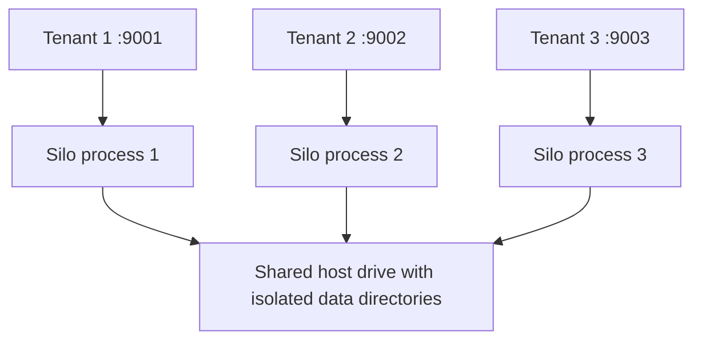
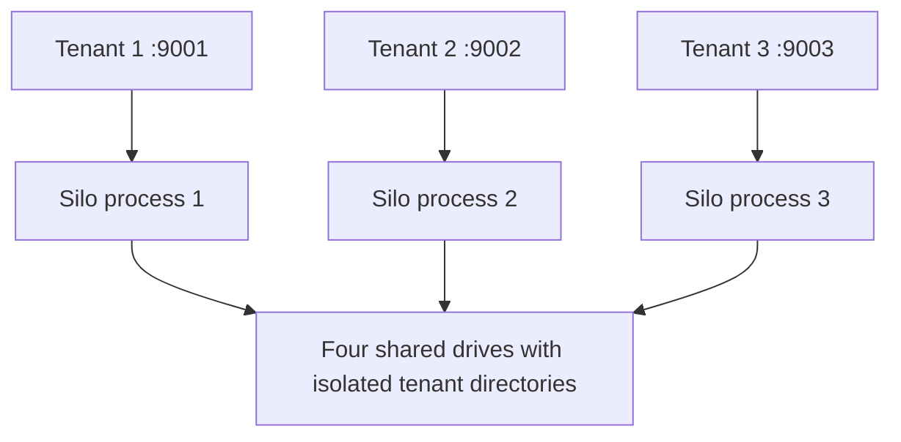
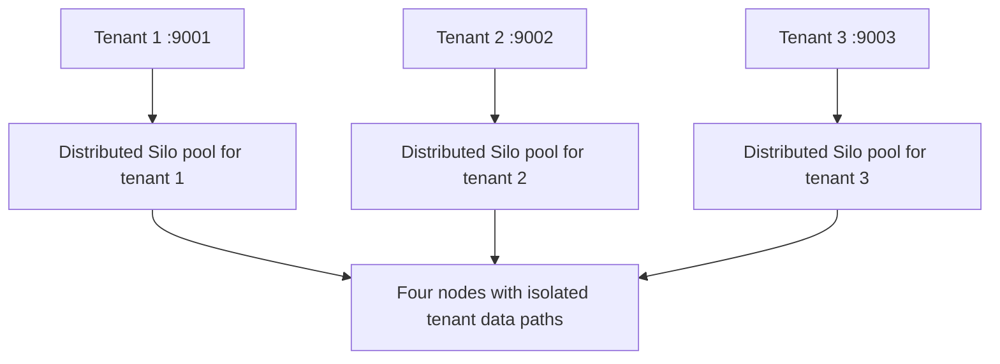

# Silo Multi-Tenant Deployment Guide [](https://hub.docker.com/r/pgsty/silo/)

This topic provides commands to set up different configurations of hosts, nodes, and drives. The examples provided here can be used as a starting point for other configurations.

1. [Standalone Deployment](#standalone-deployment)
2. [Distributed Deployment](#distributed-deployment)
3. [Cloud Scale Deployment](#cloud-scale-deployment)

## 1. Standalone Deployment

To host multiple tenants on a single machine, run one Silo Server per tenant with a dedicated HTTPS port, configuration, and data directory.

### 1.1 Host Multiple Tenants on a Single Drive

Use the following commands to host 3 tenants on a single drive:

```sh
silo server --address :9001 /data/tenant1
silo server --address :9002 /data/tenant2
silo server --address :9003 /data/tenant3
```



### 1.2 Host Multiple Tenants on Multiple Drives (Erasure Code)

Use the following commands to host 3 tenants on multiple drives:

```sh
silo server --address :9001 /disk{1...4}/data/tenant1
silo server --address :9002 /disk{1...4}/data/tenant2
silo server --address :9003 /disk{1...4}/data/tenant3
```



## 2. Distributed Deployment

To host multiple tenants in a distributed environment, run several distributed Silo Server instances concurrently.

### 2.1 Host Multiple Tenants on Multiple Drives (Erasure Code)

Use the following commands to host 3 tenants on a 4-node distributed configuration:

```sh
export MINIO_ROOT_USER=<TENANT1_ACCESS_KEY>
export MINIO_ROOT_PASSWORD=<TENANT1_SECRET_KEY>
silo server --address :9001 http://192.168.10.1{1...4}/data/tenant1

export MINIO_ROOT_USER=<TENANT2_ACCESS_KEY>
export MINIO_ROOT_PASSWORD=<TENANT2_SECRET_KEY>
silo server --address :9002 http://192.168.10.1{1...4}/data/tenant2

export MINIO_ROOT_USER=<TENANT3_ACCESS_KEY>
export MINIO_ROOT_PASSWORD=<TENANT3_SECRET_KEY>
silo server --address :9003 http://192.168.10.1{1...4}/data/tenant3
```

**Note:** Execute the commands on all 4 nodes.



**Note**: On distributed systems, root credentials are recommend to be defined by exporting the `MINIO_ROOT_USER` and  `MINIO_ROOT_PASSWORD` environment variables. If no value is set Silo setup will assume `minioadmin/minioadmin` as default credentials. If a domain is required, it must be specified by defining and exporting the `MINIO_DOMAIN` environment variable.

## Cloud Scale Deployment

A container orchestration platform (e.g. Kubernetes) is recommended for large-scale, multi-tenant Silo deployments. See the [Silo Deployment Quickstart Guide](https://silo.pgsty.com/operations/deployments/kubernetes/) to get started with Silo on orchestration platforms.
