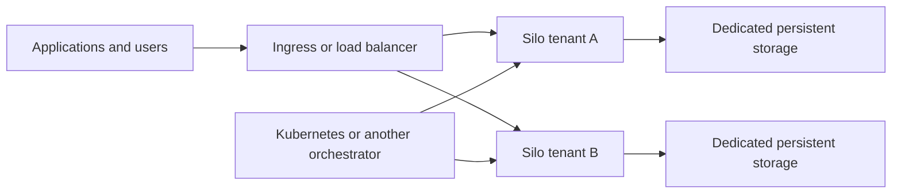

# Silo Deployment Quickstart Guide 

Silo is a cloud-native application designed to scale in a sustainable manner in multi-tenant environments. Orchestration platforms provide perfect launchpad for Silo to scale. Below is the list of Silo deployment documents for various orchestration platforms:

| Orchestration platforms                                                                            |
|:---------------------------------------------------------------------------------------------------|
| [`Kubernetes`](https://silo.pgsty.com/operations/deployments/kubernetes/)                                |

## Why is Silo cloud-native?

The term cloud-native revolves around the idea of applications deployed as micro services, that scale well. It is not about just retrofitting monolithic applications onto modern container based compute environment. A cloud-native application is portable and resilient by design, and can scale horizontally by simply replicating. Modern orchestration platforms like Kubernetes, DC/OS make replicating and managing containers in huge clusters easier than ever.

While containers provide isolated application execution environment, orchestration platforms allow seamless scaling by helping replicate and manage containers. Silo extends this by adding isolated storage environment for each tenant.

Silo is built ground up on the cloud-native premise. With features like erasure-coding, distributed and shared setup, it focuses only on storage and does it very well. While, it can be scaled by just replicating Silo instances per tenant via an orchestration platform.

> In a cloud-native environment, scalability is not a function of the application but the orchestration platform.

In a typical modern infrastructure deployment, application, database, key-store, etc. already live in containers and are managed by orchestration platforms. Silo brings robust, scalable, AWS S3 compatible object storage to the lot.

